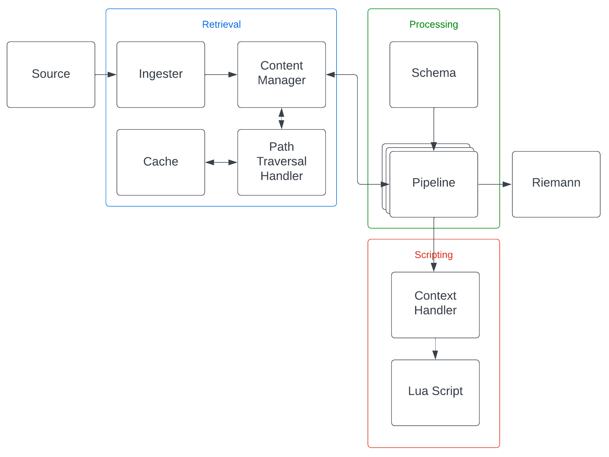

# Conduit
Structured metrics ingester based on JSON paths and destructuring patterns to produce Riemann events

## Design Requirements

TODO

## Overview

TODO

TODO: Split up details into sub-documents and just have high level details here

## Architecture

TODO: Redo this architecture diagram to reflect modern design and all components missing here

## Structure

### Ingestion

#### Source

In order to retrieve the raw metrics, sources define where they come from and the connector type used for retrieval. This
structure includes any necessary destructuring, decompression, de-mangling, etc. Depending on the kind of data being handled
a different provider SPI will need to be used that matches it. Within the schema structure this is defined, so the user is
expected to match the data provided by a source.

##### Connectors

Depending on how the raw metrics should be retrieved, a connector will be provided to determine this behaviour. In particular
connectors handle network connections and an action wrapper to invoke a retrieval request. This includes authentication
that may be required. It is up to the discretion of the implementation to handle the connection itself including any behaviour
for re-using connections, closing them, retries, etc.

Authentication models are defined by a schema, specifically the required details in order to perform the authentication itself
over a connection. The details can be dynamically resolved by the connector as needed or provided inline in the schema. This
extends to the notion of keys/certs/etc. that may be filesystem locations.

###### HTTP

TODO: Cover built in HTTP connector

#### Provider SPI

The JsonPath library provides and set of SPI abstractions for each of the core elements of data handling:

* JSON providers to creating/removing/updating elements of the data
* Mapper providers to convert between data objects and defined Java types
* Cache providers for cache policies to be used for querying the data

Supporting a new data type (such as MongoDB's BSON) will require the user to implement both the JSON and mapper providers.
In terms of the parsed objects and their structure, this is left up to the user which allows for arbitrary implementation so
long as it abides the interfaces required in these provider structures.

Caching SPIs need only be implemented if certain behaviour is desired when querying data, in terms of what is stored between
queries.

TODO

### Schema

TODO

Example: [./example/test.json](./example/test.json) targeting [./example/source.json](./example/source.json)

#### Provider

Depending on how a schema should be handled for updates and retrieving a new instance, this provider will determine that
behaviour. Implementations of this provider are only required to supply an instance of MetricsSchema upon invocation.
There are two standard options provided that can be used:

* Singleton, a new instance on every invocation
* Checksum refreshed, maintains a cached version of the schema which is returned when invoked. The cached entry is checked
  against the file on disk to determine if there are any updates. If there are, the entry is updated on next invocation.

#### Extensions

TODO: Cover schema extensions and how to use them.

##### Lua Handlers

TODO: Details on Lua handlers schema extension and how it can be used as a template

### Pipeline

A task execution pool is created to process the metrics defined in the metrics schema. This pool is configured to be of
size matching the supplied configurations. For each of the metrics, they are round-robin submitted to the queues of each
of the task executor threads to process them.

#### Task Executors

TODO: Remove mention of lua handlers here (moved to standalone schema extension)

A task executor pool manages threads that run metric collection tasks. Each executor has a queue that they consume tasks
from, perform the necessary actions and publish the results to Riemann.

The actions to perform are as follows:
1. Call pre-fetch Lua handler if it exists to filter task
2. Retrieve metric value
3. Invoke event transformer
4. Call post-fetch Lua handler if it exists to modify events
5. Publish events to Riemann

A single content manager instance is shared between all task executors (NOTE: Is it better to allow using multiple content
managers with configurable membership of one or more caches? This would allow for a degree of locality optimisation relative
to resource consumption).

Queues have a configurable size and are thread safe in terms of parallel push and pop

